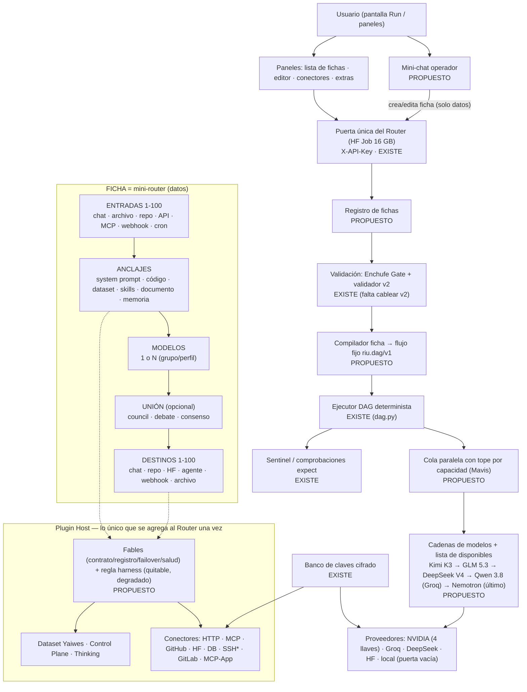

## ESTADO ACTUAL 2026-10-09

**Estructura vigente:**
```
FICHA 1: SELECTOR 14 -> 1 MODELO -> EJECUTAR -> SALIDA
FICHA 2: [DeepSeek V4 Pro | GLM 5.2 | Qwen 3.7 Max] -> Qwen 3.8 Max EJECUTA -> GLM 5.2 REVISA -> Qwen 3.8 Max REVISA -> SALIDA
FICHA 3: [DeepSeek V4 Pro | GLM 5.2 | Qwen 3.7 Max] -> DeepSeek V4 Pro EJECUTA -> GLM 5.2 REVISA -> Qwen 3.8 Max REVISA -> SALIDA
```

**Implementado** (en `router inteligente universal/fichas/`, fuera del Router): FichaOS (scheduler local por ficha), Puerta SQLite global (4 puestos, 10 min, config unica `motor/puerta.config.json`), candados de rutas entre fichas, DAG, presupuesto de tokens por ficha, cache/ledger por referencia al Harness, watchdog, pruebas, 3 fichas selladas con copias de auditoria.

**GAPS abiertos:** memoria real del Harness (`conectar_harness`), ejecutor real del Harness (`RIU_DEEPSEEK_HARNESS_URL` sin configurar: la salida sale SIN VERIFICAR), endpoint de los modelos de imagen/voz.

**Corregido:** Ask Council = 3 analizadores (no 14); sin goals; la SALIDA siempre se entrega; presupuesto por ficha; locks entre fichas; Token Plan (`token-plan.maas.qwencloudapi.com`, clave `sk-sp-*`); cache local separada de cached_tokens de la API.

**Cifras historicas:** los 8/32 workers y demas cifras de abajo son HISTORICAS (sistema anterior), no el limite del Token Plan actual (4 puestos).

Guia de las fichas: `fichas/README-FICHAS.md`. Lo que sigue es el documento historico, sin borrar.

---

# ARQUITECTURA — ROUTER INTELIGENTE UNIVERSAL · MODELO DE "FICHAS" DE FABLES
Fecha: 2026-09-29 (Bogotá) · Estado: **BORRADOR PARA APROBACIÓN DEL DIRECTOR — no se implementó nada de esto**
Base: mensaje del Director de las 04:41 (ver `INPUT-BLOCK-VERBATIM-2026-09-29-director-parte-2.md`) + archivos subidos a `Documentos del proyecto/Documentos proyectos router inteligente universal/` + código real del Router en `main`.

**Etiquetas usadas (cada afirmación lleva una):**
- **EXISTE** = comprobado leyendo el código del repo o probándolo en vivo.
- **PROPUESTO** = diseño nuevo; no está construido.
- **BLOQUEADO** = falta una decisión del Director o un archivo.
- **DEDUCCIÓN** = lo saco de los documentos, pero no está escrito tal cual; hay que confirmarlo.
- **SIN VERIFICAR** = viene de otra IA o de un documento y no se probó.

Regla que cumple este diseño: **no hay Router nuevo.** Se usa el Router que ya corre (repo `main`, HF Job). Lo nuevo se conecta por un solo punto (el plugin) y luego "no se toca más".

---
## 0. En una frase
Todo lo que se conecta al Router es una **ficha**. Una ficha es un mini-router: **ENTRADAS → ANCLAJES → MODELOS → DESTINOS**. Se crea a mano (paneles / pantalla Run) o hablándole a un mini-chat que maneja el panel por el usuario. El Router la valida, la convierte en un flujo fijo (DAG) y la ejecuta. El usuario no necesita saber qué es un MCP.

---
## 1. LOS 5 PUNTOS DE FABLES — 1 a 1, textuales, y cómo los cubre esta arquitectura
(Textos copiados del mensaje del Director de las 04:41. El Director escribió dos veces el número 4; aquí: **4** y **4 (segundo)**.)

### Punto 1
> 1. Una lista de fichas que se conecta y una coneccion con la ai para manejar la coneccion sin el uso Manual además de el banco secreto de api que ya tu viste

- **Qué significa:** una pantalla-lista con todas las fichas (estado, encender/apagar, editar, duplicar, borrar) + un chat con IA que crea y edita fichas por el usuario + las claves siempre desde el banco secreto.
- **EXISTE:** Banco de claves cifrado y `/vault` (`Banco de claves/`, `vault_api.py`); agentes con system prompt (`/chat/agents`); grupos y flujos guardados en el repo por el propio Router (`/groups`, `/workflows` en `ui_bridge.py`); autenticación por `X-API-Key`.
- **NO existe:** registro de fichas (lista con estados) ni mini-chat operador.
- **PROPUESTO:** `/fichas` (CRUD + estado + prueba) y un agente "operador del panel" (ver §7).

### Punto 2
> 2. Una ficha es como un router universal que conecta ejemplo entrada puede tener varios imput  anclaje que intervienen la comunicación o que enrutas varios modelos salida destino puede tener varios destino al final es un forma fácil de conectar sin tocar Github

- **Qué significa:** ficha = entradas (varias) → anclajes (intervienen en el camino) → uno o varios modelos → destinos (varios). Se crea desde el panel; el usuario no toca GitHub.
- **EXISTE:** `RedUniversal` + Enchufe Gate en `red/` (nodos, rutas, modos de envío `primero` / `todos` / `espejo`, salud, 5 fallos = nodo enfermo) — hoy solo lo usa el tramo Hugging Face (`router_hot_path.py`); ejecutor de flujos fijos `riu.dag/v1` (`dag.py`: entrada literal, PASS solo por comprobaciones `expect`, libro con hash); el Router guarda estado en el repo por su cuenta (sin que el usuario toque GitHub).
- **NO existe:** el formato de "ficha" ni el compilador ficha → flujo. Hoy un nodo del flujo usa 1 modelo; varios modelos = varios nodos.
- **PROPUESTO:** formato de ficha (§4) + compilador determinista (§5).

### Punto 3
> 3. El anclaje puede ser un system promt o code o data set o skills o cualquier cosa entre el imput y el destino

- **Qué significa:** un anclaje es una pieza intercambiable que se pone entre la entrada y el destino.
- **EXISTE (como piezas sueltas):** system prompt → agentes; documentos → `/chat/documents`; memoria → `/memoria/*`; dataset Yaiwes → plugin `yaiwes.dataset.router` 3.0.0 (sin cablear al Router vivo); lista de skills de HF → `hf_skills_registry.json`.
- **NO encontré:** módulo de sandbox de código en el Router (solo la auditoría `C13-CODESANDBOX-DONOR-AUDIT.md`). El código del anclaje "code" necesita ese sandbox.
- **PROPUESTO:** tabla de tipos de anclaje (§4.2).

### Punto 4
> 4. La posiblidad de unir ejemplo añades una lista de 10 ai estás cada uno van teniendo un anclaje y la final una salida como un ask consil

- **Qué significa:** poder juntar N IA, cada una con sus anclajes, y una salida final que las une (consejo).
- **EXISTE:** `/chat/jobs/run` (hasta 100 trabajos por llamada, pero solo 8 a la vez por defecto, máximo 32; cada trabajo = 1 nodo); plantilla "Ask Council" en el diseño de UI (`UI ROUTER AI_AGENT_Router_UI_Design.md` §17) y `T09_ask_council` en la lista de plantillas fijas (`diseño avanzado router inteligente.md`).
- **NO existe:** el nodo de unión (varias respuestas → juez → síntesis) en el Router vivo. El ZIP de subrouters de la otra IA trae un "council" (**SIN VERIFICAR**: sus 7 pruebas eran simuladas).
- **PROPUESTO:** `union: council` en la ficha (§4) compilado a N nodos en paralelo + 1 nodo juez.

### Punto 4 (segundo)
> 4. Basicamente es la idea de Fables y que se conecte con lo que sea archivos ai Github huggueface cualquiercosa como los plugins que tú tienes o MCP SSH token Api o lo que sea y de puede hace Manual o debajo del panel tiene un mini chat que te permite que la ai maneja el panel por el usuario

- **Qué significa:** conectar cualquier cosa (archivos, IA, GitHub, Hugging Face, plugins, MCP, SSH, token, API), a mano o con el mini-chat.
- **EXISTE en `red/conectores.py`:** HTTP, MCP, GitHub, HuggingFace, DB, VPS, Memoria, Interno, Webhook; más `conector_gitlab.py`, `conector_mcp_app.py`, `connector_registry.py`, `identity_pool.py`.
- **NO existe:** conector **SSH**, A2A, teléfono (están en el diseño v6, no en el código).
- **PROPUESTO:** conectores que faltan como plugins (§8) + detección automática (§7) + mini-chat operador (§7).

### Punto 5
> 5. Básicamente eso es todo lo idea es que el usuario no tenga que aprender que carajo es un mcp como se conecta la idea del plugins de la ai que antes no tenía ninguna ai ya Fables hace tiempo me la dio sin embargo en muchas veces hay demasiada fricción no es solo darle a un botón y listo la idea es que sea un router inteligente que hace todo automático o manual si el usuario prefiere

- **Qué significa:** cero fricción. Un solo gesto: "conectar esto". El Router detecta qué es, lo prueba y crea la ficha. Si el usuario prefiere, edita todo a mano.
- **PROPUESTO:** un solo botón/orden "Conectar": detector determinista (90 % código) + IA solo si hay duda (10 %) + prueba automática (`sondear`) + ficha creada (§7).

---
## 2. Qué dicen los archivos de Fables (resumen de lo leído)
| Archivo subido | Qué aporta |
|---|---|
| `_Run_UI_YAIWES.html` (el "mejor para entenderlo") | Pantalla única con 5 vistas: CASCADE (cadena de IA con roles, modelo, system prompt, código de entrada/salida, sandbox), TREN (16 nodos con cola de firmas y libro), AUDITOR (documentos anclados y `POST /puente/enviar`), VENTANAS (cadena 1–100 con pausas), ORQUESTA. Destinos: `agent-api`, `webhook`, `panel-run`, `filesystem`. Botón "Copiar YAML" con el flujo bloqueado. **Todo simulado** (temporizador; no llama al Router). |
| `router-v1…v5`, `panel_router_3.html`, `📌router-funciones.md` | Panel 1 lista + chat; Panel 2 editor de ficha con 4 secciones: **Entrada (1–100) / Anclaje / Salida (1–100) / Otras** (prioridad, fallback, timeout, reintentos, límite, modo `primero/todos/espejo`, costo máximo, cron, ACL, namespace); Panel 3 extras (proveedores, modelos, costos, trazas, cola, vault, recovery, mapa de red); Panel 4 billetera de conectores; Panel 5 agente/IA del chat. **98 funciones.** El chat del Panel 5 devuelve `{entradas:[], anclajes:[], salidas:[], otras:{}}` (es la idea del mini-chat). |
| `🧩FABLES … ENCHUFE_UNIVERSAL_v2.md`, `JSON para IA … enchufe.md` | Contrato de ficha-de-código v2.0: categoría (pipeline/transversal/acelerador), etapa, perfiles 0–5, presupuesto por nivel, telemetría, evidencia L1–L4, failover, firma. Validador de 36 invariantes. Regla: una ficha v1.5 válida sigue válida. **Ya está en el repo:** `enchufe/validator_v2.py`, `domain/schemas/enchufe_v2.py`. |
| `enchufe universal parte 1 / parte 2 (.py)` | Bus de plugins de Fables + Kimi (`UniversalPluginBus`) y contrato de ficha con validador. **Aún no está en el Router vivo.** |
| `2📌🔌ROUTER_UNIVERSAL_RED_CONEXIONES.md` | Código de `red/enchufe_gate.py`, `conectores.py`, `red_universal.py` (**ya en el repo**). |
| `🛜📶🛰️📡 resumen ROUTER_INTELIGENTE_UNIVERSAL_v6.md` | Arquitectura maestra v6: "todo es un Conector", catálogo de conectores (MCP, A2A, SSH, DB, HF, teléfono…), Selector por Especialidad (R2.5), módulos R1–R10, circuit breaker, caché semántica, roadmap por fases. |
| `👨‍💻🛜🛜 UI ROUTER AI_AGENT_Router_UI_Design.md` + `🛜🛜🛜👨‍💻 diseño avanzado…md` | Diseño de UI: fichas con puertos 1–100, motor de conexiones separado, panel de ingenieros, plantillas DAG **fijas** (el Router elige plantilla, la IA no inventa arquitectura), niveles de investigación, Sentinel, Judge, "¿por qué esta plantilla?". |
| `📌MAVIS-PARALLEL-100X.md`, `📌MAX-SYSTEM-100X-FINAL-1.md` | El "sistema paralelo": pool de workers, cola con prioridad, caché LRU, batcher, streaming, pipeline async, deduplicación; multi-sandbox con memoria persistente. Autor: "Mavis (Max's agent)". |
| `DOC-A00…A06`, `CHAT-B01…B11`, `PIPELINE.md`, `GAP_01_ROUTER.md`, `ROUTING_CONTRACT.md`, `indice componentes router.md` | Plan de construcción (mayo–agosto): contrato de misión, 11 tareas, DAG de construcción, fusión de 3 routers (Aurelio + vLLM Semantic Router + UIUC), índice de 57 componentes. |
| `fgh.html`, `index.html` (adjuntos 04:41) | Dos cascarones de UI ("Yaiwes UI — MAXBRY Router" y "YAIWES 2 UI"). **Faltan sus archivos `css/` y `js/` / `styles/` y `src/`** → no se puede juzgar la UI. |

**Honestidad sobre la lectura:** leí a fondo Fables v2, resumen v6, funciones, diseño de UI, Red de conexiones, DOC-A00/A02, PIPELINE (secciones de fusión/plugins), los HTML de paneles y Run, y el código del Router. **Solo hojeé** DOC-A01/A03/A04/A05/A06, `CHAT-B01` (los `B02–B11` son la misma plantilla de tarea), `diseño avanzado` y `MAX-SYSTEM` (índices y partes clave), `patch-1`, `parche-v5.4`, `tarea-1-1`. **No leí** los README de las carpetas `lote 1–5`, `Desplegar`, `Método de trabajo`, `Pipeline`, `Refactoria`, `Skills de trabajos`, `docs/`, `GUIA-DESPLIEGUE-ZIP-UNIVERSAL.md`, `README-INSTALAR.md`, `OSS_*`.

---
## 3. Diagrama (cómo funciona todo)

`*` SSH no existe en el código hoy.

**Capas (de arriba a abajo):** (1) UI (Run + paneles + mini-chat) → (2) Puerta única y autenticación → (3) Registro de fichas + validación → (4) Compilador → (5) Ejecutor de flujos fijos → (6) Cola paralela → (7) Cadenas de modelos → (8) Proveedores. El **Plugin Host** cuelga al costado: todo lo nuevo (conectores, tipos de anclaje, uniones) entra por ahí sin tocar las capas 2–8.

---
## 4. La ficha
### 4.1 Dos cosas con el mismo nombre (importante)
| | Ficha de **conexión** (Panel 2 / Run) | Ficha-**contrato** de enchufe v2.0 (Fables) |
|---|---|---|
| Para qué | Describe qué entra, qué se le pone en el camino, qué modelos, adónde sale | Describe una pieza de código/plugin para poder enchufarla (qué consume, qué expone, límites, firma) |
| Campos | entradas, anclajes, salidas, otras | `artifact_id`, categoría, etapa, `contrato`, `ejecucion`, `seguridad`, `firma`… |
| Estado | **PROPUESTO** (solo existe en los HTML) | **EXISTE** el validador (`enchufe/validator_v2.py`) |
| Relación | Cada entrada / anclaje / destino de una ficha de conexión **apunta a** una ficha-contrato de un conector o plugin y solo se conecta si ese contrato valida. |

### 4.2 Tipos de anclaje (punto 3)
| Tipo | Qué hace en el camino | Fuente hoy |
|---|---|---|
| `system_prompt` | fija el rol/instrucciones del modelo | agentes (`/chat/agents`) EXISTE |
| `documento` / `texto` | pone contexto fijo | `/chat/documents` EXISTE |
| `dataset` | trae solo los registros que hacen falta (registro → índice → rango; nunca lectura completa) | plugin `yaiwes.dataset.router` EXISTE, sin cablear |
| `skills` | añade una habilidad/procedimiento | `hf_skills_registry.json` EXISTE (registro); uso real SIN VERIFICAR |
| `code` | ejecuta un script (entrada/salida) antes o después del modelo | sandbox: **NO encontrado** (solo auditoría C13) |
| `memoria` / RAG | busca en memoria | `/memoria/*` EXISTE |
| `herramienta` (MCP/API) | llama a una herramienta externa | conectores MCP/HTTP EXISTE |
| `cualquier cosa` | lo que traiga un plugin | Plugin Host PROPUESTO |

### 4.3 Formato propuesto (ejemplo "Ask Council" de 10 IA)
```yaml
# PROPUESTO — campos tomados de los Paneles 2 y 5 (router-v2a/v2b/v2c/v5) y de la Run UI
ficha: council-revision-codigo
namespace: ai.council.codigo
entradas:                      # 1–100
  - {id: E1, tipo: chat}
  - {id: E2, tipo: repo, ref: "<owner>/<repo>@main"}
anclajes:                      # se aplican en este orden
  - {id: A1, tipo: system_prompt, ref: "agente:arquitecto"}
  - {id: A2, tipo: dataset,       ref: "yaiwes.dataset.router"}
  - {id: A3, tipo: skills,        ref: "skill:code-review"}
modelos:                       # cada modelo puede llevar sus propios anclajes
  - {id: M1, grupo: codigo,        anclajes: [A1, A3]}
  - {id: M2, grupo: razonamiento,  anclajes: [A1, A2]}
  # … hasta 10 (o las que se pidan)
union: {tipo: council, juez: {grupo: razonamiento}}
salidas:                       # 1–100
  - {id: S1, tipo: chat}
  - {id: S2, tipo: repo, ref: "<owner>/<repo>/ruta"}
otras: {modo_envio: todos, timeout_s: 60, reintentos: 1, costo_max_usd: 0.5, credenciales: "vault:<nombre>"}
```
Las claves nunca van en la ficha: solo el **nombre** del secreto en el banco.

---
## 5. Cómo se ejecuta una ficha (todo determinista salvo el modelo)
1. **Validar** la ficha (formato + Enchufe Gate/validador v2 para cada pieza). Si no valida → se rechaza, nunca "se arregla sola".
2. **Compilar** a un flujo fijo `riu.dag/v1` (anclajes y modelos = nodos; `union` = nodos en paralelo + juez) y a rutas de `RedUniversal` (modo `primero`/`todos`/`espejo`).
3. **Ejecutar** con el ejecutor que ya existe (`dag.py`): entrada literal, PASS solo por `expect`, libro con hash.
4. **Entregar** a los destinos (chat, repo, HF, webhook, archivo…).
Regla de diseño de los archivos subidos que se mantiene: la IA **rellena datos** de la ficha; **no puede** crear/borrar/reordenar nodos del motor ni inventar arquitectura (candado "DAG LOCKED" de la Run UI y del diseño de UI).

---
## 6. Modelos: lista de disponibles, prioridad y Nemotron al final (orden 04:41)
**Orden del Director:** Nemotron como última opción; el Router pide la lista de modelos disponibles; si un modelo no responde, no se bloquea (aunque haya algo de latencia); el Router ya sabe la prioridad.

**Lo que hay hoy (comprobado):**
- Cadena por defecto del chat = solo Nemotron; una segunda entrada exige autorización del Director (`authorized_fallback` apagado) — `integration/chat_mvp/resilience.py`.
- `agents-yaiwes/common/routes.py` ya tiene `disponibles()` (sondea qué modelo responde por proveedor y llave, guarda 15 min) y una lista de prioridad (kimi-k3, glm-5, deepseek-v4, …, nemotron, llama-3.3). **Solo la usan los agentes, no el chat.**
- `run_policy` usa siempre la llave 1. No salta a la 4 ni a Groq cuando está ocupada.
- `providers.py` envía solo `model`, `messages`, `max_tokens`, `temperature`: **no envía parámetros de razonamiento** (thinking).
- Prueba en vivo (NVIDIA, 4 llaves): `moonshotai/kimi-k3` 200 en 0,8 s; `z-ai/glm-5.3` 200 en 1,3 s (no existe "glm-5" a secas); `z-ai/glm-5.3-flash` y `deepseek-ai/deepseek-v4.1-flash` **no respondieron en 25 s en ninguna de las 4 llaves**. Groq `qwen/qwen3.8-27b` verificado.

**PROPUESTO — "piscina de modelos" (`model_pool`):**
1. En segundo plano, cada pocos minutos, pide `/v1/models` a cada proveedor/llave y mide una llamada pequeña → estado `disponible / lento / caído` + latencia. Se cachea.
2. Al recibir un pedido arma la cadena = prioridad del Director **filtrada por disponibles**. Nemotron va **al final**; solo entra si los demás no aparecen.
3. Si el elegido no responde en su tiempo límite, pasa al siguiente **sin bloquear** (o lanza el siguiente en paralelo y gana el primero que responda = modo `espejo`, que ya existe en `RedUniversal`).
4. Llaves NVIDIA 1–3 primero; si están ocupadas, la 4 o Groq (orden del 02:06).
5. Reglas que se mantienen: DeepSeek se salta en horas pico; sin Anthropic; sin Cerebras ni OmniRoute.

Prioridad propuesta (a confirmar): 1 Kimi K3 → 2 GLM 5.3 → 3 DeepSeek V4 (si responde) → 4 Qwen 3.8 en Groq → 5 **Nemotron (último)**.

---
## 7. Conectar "lo que sea" sin saber qué es un MCP (puntos 1, 4-segundo y 5)
**Un solo gesto: "Conectar".** El usuario pega o señala algo. El Router decide qué es con **reglas** (90 %) y solo pregunta a una IA si hay duda (10 %):

| Lo que el usuario da | Cómo se reconoce | Ficha que se crea |
|---|---|---|
| Un enlace de GitHub | forma `github.com/<dueño>/<repo>` | conector GitHub (ya existe) |
| Un enlace de Hugging Face | `huggingface.co/...` | conector HF (ya existe) |
| Una clave suelta | se **prueba** contra cada proveedor (`/v1/models`); el que responde 200 gana. Hay un mecanismo parecido en `probe_keys.py` (EXISTE, usado para el banco) | proveedor de modelos + llave al banco |
| Una dirección que responde `tools/list` | prueba JSON-RPC | conector MCP (ya existe) |
| `usuario@servidor` | forma SSH | conector SSH (**no existe; plugin**) |
| Una URL con descripción OpenAPI | trae `openapi.json` | conector HTTP/API (ya existe) |
| Un archivo | extensión/tipo | anclaje `documento`/`dataset` |
Después de crear la ficha, el Router **la prueba solo** (`sondear`) y muestra "conectado / falló y por qué". Lo manual = los mismos campos editables.

**Mini-chat operador (PROPUESTO):** es un agente más del Router cuyo único "poder" es llamar a los mismos endpoints del panel (`/fichas`, `/conectar`, `/fichas/{id}/probar`). Devuelve la ficha como datos; el Router la valida igual que si la hubiera escrito una persona. Puede crear y editar fichas; **no** puede cambiar el motor ni los flujos protegidos.

---
## 8. El plugin: Fables + harness de DeepSeek → una versión mejorada (orden 04:41)
**Comparación (leída en el código):**
| | Bus de Fables (`universal_plugin_bus_v2`, Python, 570 líneas) | Harness DeepSeek de ruflo (Node) |
|---|---|---|
| Qué es | gobierno de plugins: valida la ficha v2, registra, failover declarativo, salud (latido), presupuesto por nivel, telemetría, evidencia, intercambio en caliente | plugin mínimo: carpeta con comandos, agentes, skills y scripts |
| Fortalezas | contrato completo y ya validado; encaja con el validador que está en el repo | 3 reglas simples: **se puede quitar sin romper nada · sin dependencias duras · si falla devuelve `{status:'degraded', reason}` y no tumba nada** |
| Límites vistos | `trigger_plugin` solo responde sí/no (**no ejecuta nada**); `enchufar` exige aprobación de un "tribunal"; el intercambio en caliente ejecuta el código del candidato con `exec` y su revisión de seguridad es buscar textos como `os.system` (insuficiente para código de terceros); síncrono y sin tiempos límite | llama directo a `api.deepseek.com` con su propia llave; aquí **los modelos solo van por el Router**, así que eso NO se copia, solo el patrón |
| Router hoy | `RedUniversal` ya invoca conectores con reintentos, salud y 5 fallos = nodo enfermo (EXISTE); `PIPELINE.md` propone el mismo flujo con Pluggy: registro → manifiesto → permisos → hook → ejecución | |

**PROPUESTO — "Plugin Host" (una versión mejorada usando los dos, sin escribir un router nuevo):**
- Contrato, registro, failover, salud, presupuesto y evidencia → **de Fables** (se cablea el archivo subido; el validador ya está en el repo).
- Invocación real → **`RedUniversal` existente**.
- Regla **del harness** como envoltorio obligatorio de toda llamada a un plugin: quitable, sin dependencia dura, y si falla o se pasa de tiempo devuelve `degraded` y el Router sigue.
- Plugins = carpeta `plugins/<id>/` con `ficha.json` + código. El Router solo **monta esa carpeta** (único cambio al Router, una sola vez) y la relee cada 60 s como ya relee el repo.
- Seguridad: nada de `exec` directo de código de terceros; corre en sandbox con tiempo y memoria máximos (necesita el sandbox C13, hoy no está).
- "Tribunal" de Fables = **tu aprobación** desde el panel.

---
## 9. Dataset Yaiwes, plano de control y "thinking" (orden 04:41)
- **Dataset Yaiwes** (107 métodos / 1139 registros, plugin `yaiwes.dataset.router`) → entra como **anclaje `dataset`**: solo trae los registros necesarios. EXISTE el plugin; su cableado estaba reservado al último nodo (PLUGIN-999).
- **Plano de control Yaiwes** (fuente de verdad, compositor de contexto, consistencia, guardia de política) → se usa como **pieza previa/posterior** de la ficha (contexto y comprobaciones); no está conectado al Router vivo.
- **"Thinking":** no es un router aparte. Son **modos de ejecución** que una ficha puede elegir: Instant, Thinking nativo, Deep, Parallel, Council, Tree, Research, Code, Adaptive, Deterministic (lista de la otra IA, **SIN VERIFICAR**). `Council` = la unión del punto 4. El ZIP `yaiwes_subrouters_modulares.zip` (instant/thinking/council/code + `profiles.json`) es un punto de partida **SIN VERIFICAR**: sus pruebas eran simuladas.
- **Thinking nativo** exige ampliar `providers.py` (hoy no manda parámetros de razonamiento). Los nombres de parámetros por proveedor que dio la otra IA (NVIDIA `reasoning_effort`/`reasoning_budget`, DeepSeek `thinking`, Groq `reasoning_effort`, Qwen3 `enable_thinking`) están **SIN VERIFICAR** hasta probarlos.

---
## 10. Sistema paralelo — hasta 1000 procesos (orden 04:41)
- **Qué es "el de MiniMax" — DEDUCCIÓN:** el documento `MAVIS-PARALLEL-100X.md` lo firma "Mavis (Max's agent)"; `DOC-A00` habla del "Workflow Mavis M3↔M2.7" y el Panel 5 lista "MiniMax M3 / M2.7". Por eso lo tomo como el sistema paralelo de MiniMax. **A confirmar por el Director.**
- **Hoy (EXISTE):** `/chat/jobs/run` con hilos, 8 a la vez por defecto (máx. 32), 100 trabajos por llamada; caché exacta de respuestas en `core.py`.
- **De Mavis se toma (PROPUESTO):** cola con prioridad, pipeline asíncrono con workers, deduplicación (misma petición en vuelo = una sola llamada). **No se toma:** pool de procesos (para trabajo de CPU, no de llamadas a modelos), caché LRU/mmap (ya hay caché), batcher (las APIs de chat usadas son una petición por llamada; sin verificar que ofrezcan lotes).
- **Lo que Mavis no trae y hay que añadir (PROPUESTO): gobernador de capacidad.** "1000 procesos mientras exista API o IA local disponible" = la cola admite hasta 1000 tareas; **cuántas corren a la vez** lo fija la capacidad real de lo que esté disponible (por proveedor y por llave, con reintento al recibir 429). Si no hay ninguna API ni IA local disponible, las tareas **esperan** en la cola; no fallan. Los límites reales de cada proveedor/llave **no los conozco** → se miden con una prueba, no se suponen.
- Riesgo: 1000 llamadas simultáneas al mismo proveedor chocan con sus límites; por eso el tope sale de la capacidad medida, no del número 1000.

---
## 11. "IA local en Hugging Face" — qué hay de verdad
- **Hoy no hay ninguna IA local corriendo.** En el Router existe la **puerta** para conectar una (proveedor `local`, se activa con una dirección); está vacía.
- Hugging Face **sí ofrece máquinas** (Jobs) de 16 GB y de 32 GB. En una de 32 GB **se podría instalar y correr** un modelo pequeño (1B–10B cuantizado). **Eso no está hecho:** es la tarea T-11, "después de terminar el Router".
- DFlash 2, MTP, Flash Attention, caché KV Q8, batch 256/128 (y el inventario de "aceleradores", de otra IA, **SIN VERIFICAR**) sirven para **acelerar ese servidor local cuando exista**. Hoy no hay dónde instalarlos.
- Autoescalado (16 GB siempre activo despierta las de 32 GB; sube al 80 %; la de 32 GB duerme a los 5 min): **no está construido** (solo hay un selector puro `hf_scheduler.py` sin conectar y `hf_jobs_compute.py` que puede lanzar un Job).

---
## 12. La UI (Run) frente al Router real
- **EXISTE en la Run UI:** las 5 vistas, nodos con rol/modelo/prompt/código/sandbox, destino, y "Copiar YAML".
- **Falta para que funcione de verdad (PROPUESTO):** (a) que "Ejecutar" llame al Router en vez del temporizador; (b) que la **lista de modelos** venga del Router (`/v1/models` / `/chat/models` EXISTEN) y no esté escrita a mano; (c) que el YAML de la Run (`template / input / nodes[id, role, model] / output`) se convierta a `riu.dag/v1` (hoy son formatos distintos: lo hace el compilador del §5); (d) `__ROUTER_BASE__` apunte al Router (hoy `http://127.0.0.1:8000`).
- **Choca con las reglas:** la lista de modelos de la Run trae Claude Sonnet/Opus (regla: sin APIs de Anthropic) y el Panel 5 lista "Claude Code / Claude Sonnet 4".
- **Regla de despliegue:** Vercel = solo UI; un único despliegue final cuando el Director lo ordene.

---
## 13. Conflictos y huecos detectados
1. **Infraestructura:** los documentos de julio describen GitHub ↔ VPS Contabo (`95.111.232.89`) ↔ destinos; hoy el Router corre en un Job de Hugging Face. → decidir que el VPS es histórico.
2. **Rutas de API:** los diseños usan `/api/connections`, `/api/chat`, `/api/connectors/lib`; el Router vivo usa `/chat/*`, `/groups`, `/workflows`, `/vault/*`. → las fichas irían bajo un grupo nuevo (`/fichas/*`) con la misma autenticación.
3. **Versiones del contrato:** `red/enchufe_gate.py` (117 líneas) es de estilo v1.5; el validador v2 está en `enchufe/` pero **no comprobé que el gate lo llame**. → cablear en el trabajo único.
4. **Archivos de Fables que faltan:** el Director dice que se traspapelaron; falta al menos el CSS/JS de `fgh.html` e `index.html`. Sin ellos solo la Run se puede usar como referencia.
5. **Sandbox de código (C13)** no está en el Router y lo necesitan los anclajes `code` y el Plugin Host.
6. **8 pruebas del repo ya fallaban** antes de estos cambios (168 pasan / 8 fallan); hay que separarlas de las nuevas.

---
## 14. Orden de construcción propuesto (todo en UN solo trabajo de Hugging Face, al final)
1. Cadena de modelos: lista de disponibles + Nemotron último + salto de llaves (§6).
2. Plugin Host (§8) — el único cambio estructural al Router.
3. Registro de fichas + validación + compilador + mini-chat operador (§4, §5, §7).
4. Cola paralela con gobernador de capacidad (§10).
5. Dataset Yaiwes + plano de control + modos de thinking como anclajes/plantillas (§9).
6. Conectar la Run UI (§12).
Después, y solo después: IA local en la máquina de 32 GB y autoescalado (§11).
Cada paso: pruebas antes/después, y **un solo relanzamiento** del Router.

---
## 15. Preguntas abiertas para el Director (respuestas pendientes)
Ver el mensaje de preguntas enviado el 2026-09-29; sus respuestas se anotarán en `HANDOFF-PROVISIONAL-ROUTER.md`, sección "Órdenes 2026-09-29".

## 16. Fuentes
- Repo `main` commit `2f5c111e` (carpeta `Documentos del proyecto/Documentos proyectos router inteligente universal/`).
- Código leído: `integration/chat_mvp/{resilience,providers,core,router,route_api,dag,jobs,jev,ui_bridge}.py`, `red/{conectores,red_universal,enchufe_gate}.py`, `agents-yaiwes/common/{routes,probe_keys}.py`, `Componente open soure…/ruflo/plugins/ruflo-deepseek-harness/`.
- Prueba en vivo NVIDIA/Groq: `EVIDENCIA-2026-09-29-NVIDIA-Y-COMPONENTES.md`.
