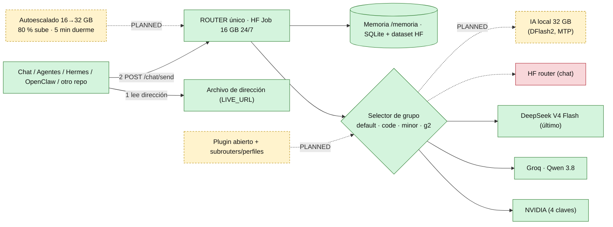

# HUELLA DIGITAL — ROUTER YAIWES
Schema: yaiwes.router-fingerprint/v1 · Snapshot: 2026-09-29 · Commit revisado: `39709cf5` (main) · Auditor: Claude (sesión del Director)
Regla: solo hechos que leí en el código o probé. Lo demás dice `UNKNOWN`, `PLANNED` o `SIN VERIFICAR`. Sin claves: solo nombres.
Estados: ACTIVE = probado · CONFIGURED = declarado, no probado · PARTIAL · BLOCKED · OFFLINE · PLANNED = propuesta · UNKNOWN.

## A. Identidad
- Nombre: Router inteligente universal (UNO solo). Repo: https://github.com/maxbry123-commits/router-universal-router-inteligente- · rama `main`.
- Función: recibe peticiones de chat y agentes y las reparte a proveedores de modelos (NVIDIA → Groq → …) con cadenas de respaldo.
- Entrypoint: `router inteligente universal/integration/chat_mvp/app.py` (FastAPI) · arranque: `agents-yaiwes/common/router_job_persistent.py` (clona el repo, descifra el banco, uvicorn, vuelve a bajar el repo cada 60 s).
- Corre en: Job de Hugging Face `6abb503a6b030d633f6a2dca`, cpu-basic 16 GB, puerto 8000 · estado: ACTIVE (smoke run 36528065394).
- Micro flujo: ENTRADA → ROUTER → CADENA → PROVEEDOR → SALIDA.

## B. Mapa de conexiones
| ID | Origen → Destino | Protocolo | Auth (nombre) | Archivo | Estado |
|---|---|---|---|---|---|
| C1 | Cliente → Router (`LIVE_URL`) | HTTPS 443 | `Authorization: Bearer HF_TOKEN_1` + `X-API-Key: RIU_ROUTER_API_KEY` | `router_job_persistent.py` | ACTIVE |
| C2 | Cliente → archivo de dirección (`ROUTER_JOB_PAUSE.flag`, raw GitHub) | HTTPS | ninguna (público) | `riu-router-job-central.yml` | ACTIVE |
| C3 | Router → NVIDIA `https://integrate.api.nvidia.com/v1` | HTTPS | `NVIDIA_API_KEY_1..4` | `providers.py` | ACTIVE (cadena visible en el estado) |
| C4 | Router → Groq `https://api.groq.com/openai/v1` | HTTPS | `GROQ_API_KEY_2..7` (la 1 dio 401) | `providers.py` | ACTIVE (modelo `qwen/qwen3.8-27b` respondió "OK") |
| C5 | Router → HF `https://router.huggingface.co/v1` | HTTPS | `HF_TOKEN_1` | `providers.py` | BLOCKED en chat (provider=hf da 400/401) |
| C6 | Router → DeepSeek / Moonshot / MiniMax directos | HTTPS | `DEEPSEEK_API_KEY`, `MOONSHOT_API_KEY`, `MINIMAX_API_KEY` | `providers.py` | CONFIGURED (sin claves probadas) |
| C7 | Router → API local (llama.cpp/Ollama/vLLM) | HTTP | `RIU_LOCAL_API_KEY`, dirección `RIU_LOCAL_BASE_URL` | `providers.py` | PLANNED (no hay servidor local vivo) |
| C8 | Lanzador (GitHub Actions) → HF Jobs | HTTPS | `HF_TOKEN_1` + PAT de GitHub | `riu-router-job-central.yml` | ACTIVE |
| C9 | Router → GitHub (`/gh/*`) | HTTPS | `GITHUB_TOKEN` | `ui_bridge.py` | CONFIGURED |
| C10 | Router → dataset HF `COMAND-CENTER-1/yaiwes-hf-memoria` | HTTPS | token HF | `memoria_loader.py` | UNKNOWN (fallback SQLite declarado, sin prueba) |
Micro flujo: ORIGEN → PROTOCOLO → PUERTO → DESTINO.

## C. Router máster y subrouters
- Máster: `integration/chat_mvp/app.py`. Montado: chat MVP (`/chat`), `/vault`, `/chat/jobs/run`, `/chat/route` y `/chat/router/status`, `/gh/*` `/control/*` `/groups` (ui_bridge, dentro de try), `/memoria/*` (dentro de try), `/health` `/v1/models` `/v1/chat/completions` `/chat/models`.
- `/omniroute/*`: app.py intenta montar `omniroute_proxy`, pero ese archivo NO existe en main (verificado listando la carpeta) → no se monta; el Router sigue arriba (por el try). OmniRoute fue eliminado por orden del Director.
- Selector: hoy = grupos de cadenas en `resilience.py` (`default`, `code`, `minor`, `g2`). Sin subrouters ni perfiles intercambiables: PLANNED (propuesta de otra IA en ZIP, SIN VERIFICAR, ver handoff).
- Micro flujo: ROUTER MÁSTER → GRUPO/CADENA → PROVEEDOR/MODELO → RESPUESTA.

## D. Cadenas y modelos (verificado en `/chat/router/status` del Job vivo)
| Grupo | Cadena |
|---|---|
| default | NVIDIA `nvidia/nemotron-3-super-120b-a12b` |
| code | MiniMax → NVIDIA Nemotron (HF se salta: NOT_CONFIGURED) |
| minor | DeepSeek V4 Flash (HF; se salta en hora pico) → Nemotron → MiniMax |
| g2 | NVIDIA Nemotron → Groq `qwen/qwen3.8-27b` → (local: sin modelo) → DeepSeek V4 Flash |
- Agentes (`agents-yaiwes/common/routes.py`): prueba qué modelos responden y prioriza Kimi K3 → GLM-5 → DeepSeek V4 → otros; hasta 4 claves NVIDIA y 7 Groq. Esto NO aplica al chat del Router (usa `resilience.py`): hoy el chat no tiene Kimi K3 ni GLM-5 en sus cadenas. Ese cambio no lo hice yo ni Opus: falta (orden del Director 2026-09-29, ver handoff).
- Cerebras: eliminado del código (commit 7fa21739).

## H. Cómputo
| Recurso | Estado |
|---|---|
| Job Router HF cpu-basic 16 GB (24/7) | ACTIVE |
| HF Job 16 GB extra / 32 GB (cpu-upgrade) bajo demanda | NO EXISTE en marcha |
| Autoescalado (encender el siguiente al 80 % y dormir a los 5 min, según el Director) | PLANNED: `integration/huggingface/hf_scheduler.py` solo tiene la lógica pura de elegir HF1/HF2/HF3 con tope 95 % de RAM, sin telemetría ni encendido; nada la llama. `hf_jobs_compute.py` puede lanzar un Job (por defecto cpu-upgrade) pero no lo hace solo. El "autoescalado" figuraba como PENDIENTE de Opus (OPUS-PENDIENTE B2.6) y no llegó a construirse. |
- Space `claude-github-mcp-backup` (conector MCP): protegido, no se toca.

## J. Memoria
- `/memoria/health|save|load|search` (`memoria_loader.py`, SQLite con dataset HF como respaldo): CONFIGURED. Dataset privado `yaiwes-hf-memoria`: existe (inventario HF); integración completa UNKNOWN.

## K. Kernel / DSL / DAG
- `agent-microkernel/kernel/{dag_loader,dispatcher}.py` (rutas permitidas: nvidia, groq), `integration/chat_mvp/dag.py`, `agents-yaiwes/` (852 archivos, agentes con `chain.yaml`). Un YAML sin motor no es un workflow operativo: las cadenas de agentes están CONFIGURED; las probadas por pruebas automáticas son las del código del Router.

## L. Seguridad
- Autenticación por cabeceras (C1). Claves: banco cifrado `router inteligente universal/Banco de claves/`, descifrado al arrancar; el repo es PÚBLICO: nunca valores. Anthropic API: prohibida por el Director.

## M. Observabilidad y pruebas
- Prueba manual: `riu-router-smoke.yml` (solo lectura). Pruebas automáticas: 168 pasan, 8 fallan, 0 errores (run 36526076292); los 8 fallos existían antes.
- Último incidente: 2026-09-29 02:15Z un vigilante canceló el Job (ya borrado).

## N. Estados (FSM)
Router: HEALTHY (Job 6abb503a…). Autoescalado: STOPPED (no existe). Servidor de IA local: STOPPED (no existe).

## O. Raíz real (main)
`router inteligente universal/` (Router, Banco de claves, HANDOFF-PROVISIONAL-ROUTER.md, CONECTAR-ROUTER.md) · `chat router/` (agentes, espejos, memoria) · `Readme arquitectura router inteligente universal/` · `Huggingface/` · `Vercel/` · `Estado y handoff global/` · `Motores descarga extracción búsquedas/` · `Documentos del proyecto/` · `.github/workflows/`.

## Diagrama visual (GitHub lo dibuja solo)

Leyenda: verde = EXISTENTE y probado · amarillo punteado = PROPUESTO (no construido) · rojo = BLOQUEADO.

## Q. Huella
Commit `39709cf5` · esquema v1 · conexiones reales: C1–C4, C8 · recursos activos: 1 Job · desconectados: HF chat, local, autoescalado · bloqueos: provider=hf, `omniroute_proxy` ausente.
