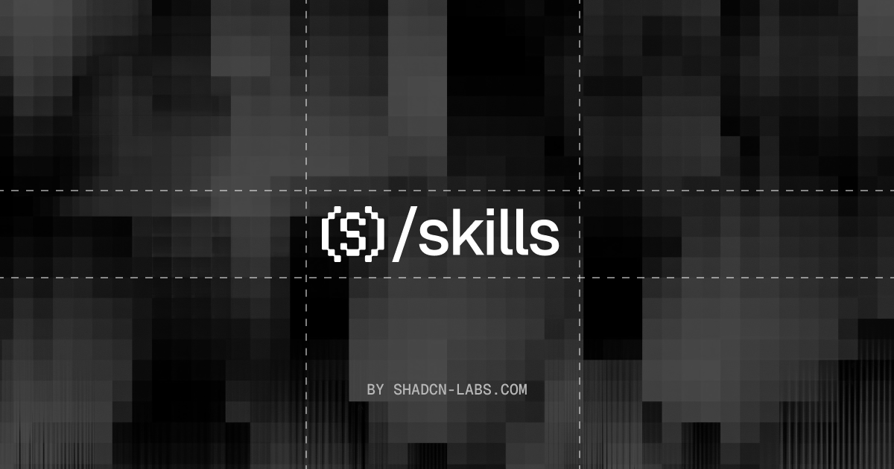

<p align="center">
  
</p>

<h1 align="center">Skills</h1>

<p align="center">
  <a href="https://github.com/shadcn-labs/skills"></a>
  <a href="./LICENSE"></a>
  <a href="https://discord.gg/N6G36KhYK4"></a>
  <a href="https://x.com/shadcnlabs"></a>
  <a href="https://bsky.app/profile/shadcnlabs.bsky.social"></a>
  <a href="https://www.reddit.com/r/shadcnlabs/"></a>
</p>

<p align="center">
  <sub><a href="./README.zh-CN.md">中文</a></sub>
</p>

<div align="center">

Agent skills for [Shadcn Labs](https://shadcnlabs.com). Install with the [skills CLI](https://github.com/vercel-labs/skills).

</div>

## Install

```bash
npx skills add shadcn-labs/skills
```

## Skill overview

### launch-shadcn-registry

Validate and launch a custom shadcn/ui registry through directory pull requests, community listings, and platform-specific post drafts.

```bash
npx skills add https://github.com/shadcn-labs/skills --skill launch-shadcn-registry
```

[](https://skills.sh/shadcn-labs/skills/launch-shadcn-registry)

### mastra-file-agents

Migrate Mastra agents from a `Mastra({ agents })` map to one directory per agent under `src/mastra/agents/`.

```bash
npx skills add https://github.com/shadcn-labs/skills --skill mastra-file-agents
```

[](https://skills.sh/shadcn-labs/skills/mastra-file-agents)

### tailwind-to-stylex

Migrate TailwindCSS utilities to StyleX by resolving each class to CSS, reshaping it with `stylex.create`, and applying it through `stylex.props` or `stylex.attrs`.

```bash
npx skills add https://github.com/shadcn-labs/skills --skill tailwind-to-stylex
```

[](https://skills.sh/shadcn-labs/skills/tailwind-to-stylex)

### icon-set-generator

Draw a custom SVG icon set that actually looks like a set — locked style spec, optical size envelopes, a reusable-parts registry, plus a validator and a preview page.

```bash
npx skills add https://github.com/shadcn-labs/skills --skill icon-set-generator
```

[](https://skills.sh/shadcn-labs/skills/icon-set-generator)

### icon-set-audit

Audit an existing SVG icon set for consistency — spec drift, divergent recurring parts, near-duplicates, optical size outliers — and report what to fix in priority order.

```bash
npx skills add https://github.com/shadcn-labs/skills --skill icon-set-audit
```

[](https://skills.sh/shadcn-labs/skills/icon-set-audit)

### icon-set-extend

Add icons to an existing set so they're indistinguishable from the originals — infers the spec and shared parts from the files, including for Lucide, Heroicons, Phosphor and friends.

```bash
npx skills add https://github.com/shadcn-labs/skills --skill icon-set-extend
```

[](https://skills.sh/shadcn-labs/skills/icon-set-extend)

## License

Published under the [MIT license](LICENSE).

